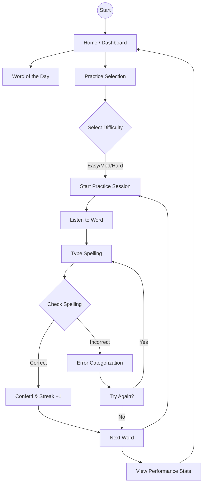
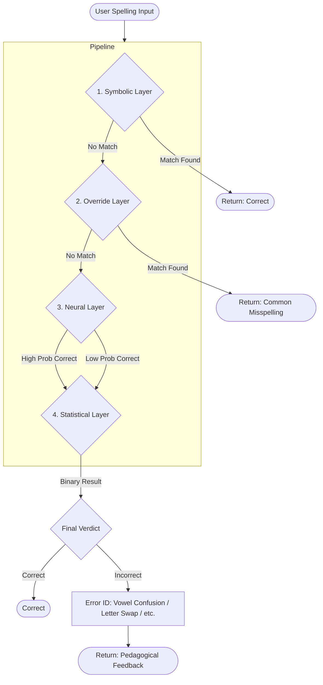

# 🐻 AI Spelling Tutor

**A spelling correction and error-categorization engine designed for adaptive learning.** 
This project goes beyond simple autocorrect by utilizing a multi-layered inference pipeline to identify *why* a student made a mistake, providing the granular feedback necessary for effective language acquisition.

---

## 🚀 Key Features

- 🎧 **Adaptive TTS**: dynamic text-to-speech generation via gTTS for auditory-based practice.
- ✅ **Hybrid Correction**: Combines the precision of deterministic lookups with the "intuition" of Transformer-based models.
- 📊 **Pedagogical Error ID**: Categorizes mistakes into specific types (e.g., Vowel Confusion, Letter Swaps) to track student progress.
- 🔥 **Gamified Learning**: Streak tracking, confetti animations, and adaptive difficulty levels (Easy → Medium → Hard).
- ✨ **Word of the Day**: Daily focused practice with offline fallbacks- ✨ Word of the Day with offline fallback
- 🎉 Confetti animation on correct answers

---

## 📽 DEMO
[Watch the Application Demo](https://drive.google.com/file/d/1O8GErXYfHnrNbjWfsZ2txzJcwi-bJ9SW/view?usp=sharing)

---
## 📱 App Screens  

<div align="center">
<table>
<tr>
<td align="center">
  <br>
  <b>Practice Screen</b><br>
  <sub>Listen and spell the word</sub>
</td>

<td align="center">
  <br>
  <b>Home Screen</b><br>
  <sub>Dashboard and Word of the Day</sub>
</td>

<td align="center">
  <br>
  <b>Spelling Input</b><br>
  <sub>Typing with active hints</sub>
</td>
</tr>

<tr>
<td align="center">
  <br>
  <b>Error Feedback</b><br>
  <sub>Analysis of a 'Tricky Vowel' mistake</sub>
</td>

<td align="center">
  <br>
  <b>Results Screen</b><br>
  <sub>Summary after a practice set</sub>
</td>

<td align="center">
  <br>
  <b>Performance Stats</b><br>
  <sub>Streak and accuracy tracking</sub>
</td>
</tr>
</table>
</div>


## 🗂 Project Structure

```
AI-Spelling-Tutor/
├── api_server.py               ← FastAPI backend entry point
├── requirements.txt
├── data/
│   └── correct_words.txt       ← Word bank
├── src/
│   ├── hybrid_inference.py     ← DistilBERT + char-level pipeline
│   ├── bert_model.py           ← DistilBERT model loader
│   ├── char_model.py           ← Character-level classifier
│   ├── word_bank.py            ← Word selection by difficulty
│   └── tts.py                  ← Google TTS (gTTS)
├── models/
│   └── char_model/
│       ├── spelling_binary_model.pkl
│       ├── spelling_binary_vectorizer.pkl
│       ├── spelling_error_model.pkl
│       └── spelling_error_vectorizer.pkl
├── distilbert_spelling/        ← Fine-tuned DistilBERT weights
├── app/
│   ├── agent.py
│   └── streamlit_app.py        ← Streamlit web demo
├── mobile_app/
│   ├── app/
│   │   ├── (tabs)/
│   │   │   ├── index.tsx       ← Home screen
│   │   │   ├── practice.tsx    ← Spelling practice screen
│   │   │   └── progress.tsx    ← Progress & stats screen
│   │   ├── feedback.tsx
│   │   └── _layout.tsx
│   ├── components/
│   │   ├── common/             ← Badge, BigButton, LoadingSpinner
│   │   ├── feedback/           ← ConfettiEffect, ResultCard, ErrorExplanation
│   │   ├── home/               ← WordOfTheDay
│   │   ├── practice/           ← WordAudioPlayer, SpellingInput, HintReveal, DifficultySelector
│   │   └── progress/           ← StatCard, StreakCounter
│   ├── hooks/
│   │   ├── useAudio.ts
│   │   ├── useProgress.ts
│   │   ├── useSpellCheck.ts
│   │   └── useWord.ts
│   ├── services/
│   │   ├── api.ts
│   │   ├── spellcheck.ts
│   │   └── wordBank.ts
│   ├── store/
│   │   ├── gameStore.ts
│   │   └── progressStore.ts
│   ├── constants/              ← colors, typography, difficulty
│   ├── types/                  ← TypeScript interfaces
│   ├── utils/                  ← storage, hintGenerator, errorMessages
│   └── assets/
│       └── fonts/              ← Nunito font family
└── notebooks/
    └── spelling.ipynb          ← Model training notebook
```

---

## 📽 DEMO
[Watch the Application Demo](https://drive.google.com/file/d/1O8GErXYfHnrNbjWfsZ2txzJcwi-bJ9SW/view?usp=sharing)

---

## 🗺 App Flow



## 🏗 Architecture Diagram



---

## 🛠 Tech Stack

| Component | Technology |
| :--- | :--- |
| **Backend** | Python 3.12, FastAPI, Uvicorn |
| **Deep Learning** | PyTorch, HuggingFace Transformers (DistilBERT) |
| **Classical ML** | Scikit-learn, Logistic Regression (Character N-grams) |
| **Mobile** | React Native, Expo SDK 54, TypeScript, Zustand |
| **Audio** | gTTS (Google Text-to-Speech), expo-av |
| **Infrastructure** | Render (Deployment), Ngrok (Dev Tunneling) |

---

## 🧠 Architecture & Logic

The system employs a **Waterfall Hybrid Inference Pipeline** to balance latency, accuracy, and interpretability:

1.  **Symbolic layer (Dictionary)**: Instant O(1) check against a curated word bank for exact matches.
2.  **Override Layer (Common Misspellings)**: A deterministic map for high-frequency linguistic "traps."
3.  **Neural Layer (DistilBERT)**: Evaluates the "plausibility" of the word. Trained on balanced synthetic data to identify valid English-like structures.
4.  **Statistical Layer (Char-level LogReg)**: A character-level n-gram (2-5 grams) Logistic Regression model that performs the final binary classification and, if incorrect, routes to a multi-class classifier to identify the **Error Type**.

### Error Classification Types
- `letter_drop`: Missing characters (e.g., "hapening" instead of "happening").
- `letter_swap`: Transparent transpositions (e.g., "reiceve").
- `extra_letter`: Redundant characters.
- `vowel_confusion`: Phonetically similar vowel swaps (e.g., "separgate").

---

## 🧪 Machine Learning Deep Dive

### Synthetic Data Generation
To train a robust classifier without a proprietary dataset, I developed a custom synthetic error generator that simulates common human cognitive biases in spelling:
- **Phonetic Vowel Confusion**: Targeted swaps of `a, e, i, o, u`.
- **Typographical Swaps**: Simulating keyboard adjacent or cognitive order errors.
- **Random Drops/Injections**: Simulating fast-typing or phonetic omission.

### Model Evaluation
For the character-level classifier, **Macro F1-score** was chosen as the primary metric (achieving ~0.71). 
> **Why Macro F1?** Our dataset (Synthetic vs. Correct) is inherently imbalanced. Macro F1 ensures we treat the 'Incorrect' class (the minority) with equal importance to the 'Correct' class, preventing the model from over-biasing toward a 1.0 accuracy score by simply guessing "Correct" every time.

---

## 🏗 Installation

### 1. Model Setup
Download the fine-tuned DistilBERT weights and save them to a directory named `distilbert_spelling/` in the root of the project.
- **Download Link**: [DistilBERT Weights (Google Drive)](https://drive.google.com/drive/folders/1vtmAJMCh0IcBntfTnukbL9NPWSHHL0tn?usp=sharing)

### 2. Backend Setup
```bash
# Set up environment
python -m venv .venv
source .venv/bin/activate  # Or .venv\Scripts\Activate.ps1 on Windows

# Install dependencies
pip install -r requirements.txt

# Launch FastAPI
uvicorn api_server:app --host 0.0.0.0 --port 8000
```

### 2. Mobile Setup
```bash
cd mobile_app
npm install --legacy-peer-deps
npx expo start
```

---

## 🎓 Lessons Learned & Future Work

### 1. Tokenizer Constraints
**The Challenge**: Standard Sub-word tokenizers (like BERT's WordPiece) often obscure spelling errors by breaking misspelled words into nonsensical sub-tokens.
**The Solution**: Future iterations will explore **Character-BERT** or **ByT5**, which operate directly on raw bytes/characters, making them significantly more robust for character-level tasks.

### 2. Data Realism
**The Challenge**: Synthetic data, while useful for bootstrapping, lacks the nuance of real student errors.
**The Next Step**: Integration of the **BEA 2019 Shared Task** dataset or the **GitHub Typo Corpus** to fine-tune the DistilBERT layer on actual human behavioral patterns.

### 3. Deployment Optimization
**Performance**: To achieve sub-100ms inference on the neural layer for real-time tutoring, the next phase involves exporting the DistilBERT model to **ONNX Runtime** with **INT8 Quantization**, allowing for CPU-optimized high-throughput deployment on Render or AWS Lambda.

---

## 📄 License & Contact
Distributed under the MIT License.


